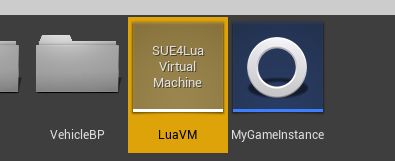
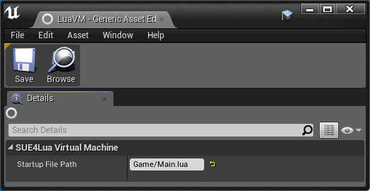

How To Create VM Assets
=======================

To run a lua code, you must first create a Lua VM(Virtual Machine).
You can simply create a VM using C++, but it is convenient to create a VM as an uasset.

For more information, please see [this](HowToCreateVMInstance.md).

Note: 
* You can create multiple VM assets without any problems. But, you can't pass lua values to other VMs.

Creating VM Assets
------------------

1. Right-Click in the Content Browser to open the context menu.
2. Miscellaneous -> choose 'SUE4Lua Virtual Machine'.
3. When the window for selecting the parent class opens, select 'SUE4LuaVirtualMachine'.

Editing VM Properties
---------------------

Double-Click the VM asset in the Content Browser to edit it.

* Startup File Path

    When the VM is started, the specified file will be executed.

------------------------------------------------
[Back to Programming Guide](ProgrammingGuide.md)