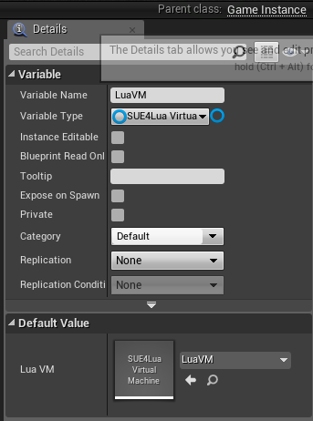
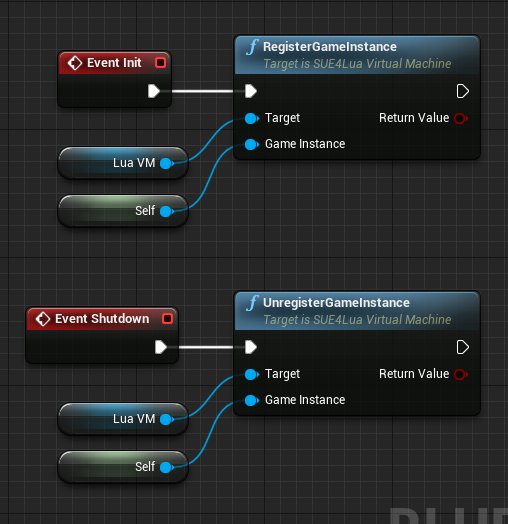

How to Register a Game Instance with VM Asset
=============================================

To use VM assets in a game, you must register the game instance with the VM asset after the game starts.
If this step is missing, all calls through the VM assets will not work.

If you created the VM directly in C++, you can skip the following steps.

For convenience, we have implemented it with blueprint, but with C++ you can implement in much the same way.

1. Open the GameInstance blueprint in the editor and add LuaVM variable.

* The variable type is _SUE4Lua Virtual Machine_.
* Set the default value to the VM asset you created.

2. Add the following code to the Init and Shutdown events.

------------------------------------------------
[Back to Programming Guide](ProgrammingGuide.md)