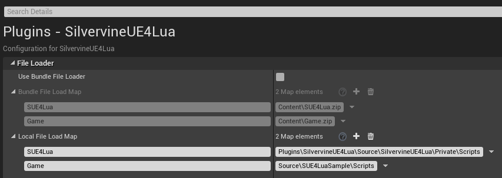
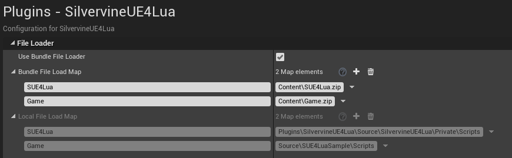

Lua 파일 로더 설정하기
=====================

SUE4Lua는 모든 Lua 파일을 [파일 로더 클래스](../Source/SilvervineUE4Lua/Public/LuaFileLoader.h)를 통해 읽어옵니다.
이 문서에서는 작업자의 실행 환경 및 빌드 종류 마다 적절한 Lua 파일 로더를 선택하는 방법에 대해 설명합니다.

Lua Local FileLoader
--------------------

직접 Lua 파일을 편집하는 작업자는 로컬 파일로더를 사용해야 합니다.
주로 엔지니어, 디자이너(기획자)가 이렇게 사용합니다.

설정 방법:

1. 프로젝트 설정 창을 열고 Plugins -> SilvervineUE4Lua로 이동합니다.

2. Use Bundle File Loader 체크를 해제합니다.

3. Local File Load Map에 Lua 파일이 들어있는 경로들을 등록합니다.

* 맵의 Key 값으로 _가상 경로_ 를 설정합니다. SUE4Lua는 Lua 파일 경로를 지정할 때 실제 경로를 사용하지 않고 가상 경로를 사용합니다.
* 맵의 Value 값으로 원하는 Lua 파일들이 들어있는 디렉토리 이름을 설정합니다.

파일 관리의 편의성을 위해서 다음의 두 개의 가상 경로만 사용할 것을 추천합니다.

* `SUE4Lua` : SUE4Lua 플러그인에 들어있는 필수 Lua 파일들을 읽을 때 사용합니다.

    예: SUE4Lua/Framework/SUE4Lua.lua

* `Game` : 게임 모듈이 사용할 Lua 파일들을 읽을 때 사용합니다.

    예: Game/Main.lua

참고:
* [SUE4LuaSample](SUE4LuaSample_ko.md) 프로젝트는 로컬 파일 로더를 사용하도록 설정되어 있습니다.

Lua Bundle FileLoader
---------------------

번들 파일이란 여러 개의 파일을 하나로 합친 파일을 뜻합니다. 주로 사용하는 번들 형식은 zip 입니다.

보통, Lua 소스 코드를 수정하지 않는 작업자들은 소스코드 저장소를 설치하기 않기 때문에,
빌드 머신이 자동으로 생성해서 배포하는 번들 파일을 사용합니다.

게임을 배포할 때에는 반드시 번들 파일로더를 사용해야 합니다. 게임을 배포할 때 소스코드를 제공하는 일은 거의 없기 때문입니다.

설정 방법:

1. 프로젝트 설정 창을 열고 Plugins -> SilvervineUE4Lua로 이동합니다.

2. Use Bundle File Loader를 체크합니다.

3. Bundle File Load Map에 번들 파일이 들어있는 경로들을 등록합니다.

* 맵의 Key 값으로 로컬 파일 로더와 동일한 가상 경로로 설정합니다.
* 맵의 Value 값으로 번들 파일의 경로를 설정합니다. 가상 경로 하나당 번들 파일 하나를 지정합니다.

참고:
* 현재 zip 형식만 지원합니다.
* 빌드 자동화 등의 CI(Continuous Integration)를 구축하여 번들 생성 및 배포를 자동화하면 매우 편리합니다.

----------------------------------------------------
[프로그래밍 가이드](ProgrammingGuide_ko.md)로 돌아가기