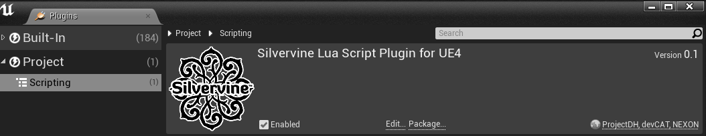

SilvervineUE4Lua
================

SilvervineUE4Lua(이하 SUE4Lua)는 UE4에서 Lua를 사용하여 게임을 개발할 수 있게 해주는 플러그인 입니다.

저희는 이 플러그인을 사용해서 [드래곤하운드](https://www.youtube.com/watch?v=m-AS21f7Rao) 라는 게임을 개발하고 있습니다.

프로그래밍 가이드는 [여기](ProgrammingGuide_ko.md)에 있습니다.

개발 동기
--------

UE4 Blueprint는 훌륭한 도구입니다만 몇 가지 문제점이 있습니다.

* 그래프 복잡도 제어가 어렵습니다. 조금만 방심하면 관리하기 어려울 정도로 흐름이 복잡하게 꼬입니다.
* 협업이 어렵습니다.바이너리 포맷이라서 브랜칭 및 병합, 변경점 보기가 어렵습니다.
* 디버깅이 어렵습니다. 엔진이 제공하는 기능만으로 버그를 찾기가 쉽지 않습니다.

위 문제들을 해결하기 위해 저희는 Lua 스크립트를 도입하기로 결정했고 이와 같은 플러그인을 개발하게 되었습니다.

특징
----

SUE4Lua에는 다른 UE4 Lua 스크립트 플러그인과 다른 몇 가지 특징이 있습니다.

* Lua를 바이너리 어셋이 아닌 텍스트 코드로 취급합니다. 

    작업자는 UE4 에디터에서 Lua를 편집하지 않고 Visual Studio나 Visual Studio Code같은 텍스트 편집기를 사용합니다.

* Lua 파일 저장소로 git 과 같은 도구를 사용할 수 있습니다. 

    일반적인 소스코드처럼 Lua 코드를 Branch, Merge, Diff 할 수 있습니다.

* Lua로 클래스 타입을 생성하지 않습니다. 

    Blueprint 혹은 C++ 클래스의 파생 클래스를 Lua로 구현하면 장점보다 단점이 더 크다고 생각합니다.

* Lua를 Blueprint의 그래프 복잡도를 낮추고 C++와 Blueprint 사이의 통신을 위한 용도로 사용합니다. 

지원 환경
--------

저희가 개발하고 있는 게임이 Windows PC 플랫폼(64bit)이기 때문에 다른 환경에서는 테스트를 하지 못했습니다. 

플랫폼 종속적인 코드를 작성하거나 사용하지 않았기 때문에 Windows 이외의 플랫폼에서도 정상적으로 동작해야 합니다. 문제가 발생한다면 제보 부탁 드리겠습니다. 

지원하는 UE4 버전은 다음과 같습니다.

* 4.21
* 4.22
* 4.23
* 4.24

SUE4Lua는 4.19 버전부터 개발을 시작했습니다. 때문에, 과거 엔진 버전에서도 큰 문제 없이 동작할 것으로 예상합니다.

참고:
* 4.20 버전은 UHT(Unreal Header Tool)의 버그로 SUE4Lua의 코드젠 모듈이 제대로 빌드되지 않습니다. 이 문제는 엔진 수정 없이 우회하기 어려우니 4.20 버전에 SUE4Lua를 사용하지 않는 것을 권장합니다.
* 4.23 부터 인스톨된 엔진 빌드에서 SUE4Lua 플러그인가 빌드 오류를 발생시키는 문제가 발견되었습니다. 아래와 같은 방법으로 우회할 수 있습니다.
1. Engine/Config/BaseEngine.ini를 엽니다.
2. `InstalledPlatforms` 섹션의 `HasInstalledPlatformInfo`를 _false_ 로 수정합니다.

지원하는 Lua 버전은 다음과 같습니다.

* 5.3.4

5.1.5 버전도 큰 문제 없이 동작하겠으나 몇 가지 이슈가 있습니다.
* _integer_ 타입이 없어서 `int64` 형식을 Lua로 전달하면 값이 잘릴 수 있습니다.
* `__pairs` 메타메서드를 지원하지 않기 때문에 UObject, UStruct, TArray 등을 pairs()로 순회할 수 없습니다.

참고:
* SUE4Lua 소스코드에 이미 lua 5.3.4 소스코드가 포함되어 있습니다.
* LuaJIT는 지원할 계획이 없습니다.

설치 방법
--------

1. 이 저장소를 클론하신 후 Plugins/SilvervineUE4Lua 폴더를 원하시는 uproject의 Plugins 폴더 아래에 복사합니다.

2. UE4 에디터에서 uproject를 연 다음 Plugins 설정 창에서 SilvervineUE4Lua를 활성화 합니다.

3. 에디터를 재시작하면 플러그인을 빌드할 것인지 묻는 창이 뜹니다. 빌드를 수락합니다.

4. 빌드가 완료되고 에디터가 시작되면 이제 SUE4Lua를 사용할 수 있습니다. 

SUE4Lua를 위해 엔진 소스코드를 수정하지 않았으니 UE4 엔진은 순정 버전을 그대로 사용하시면 됩니다.

참고:
* 직접 플러그인을 빌드하지 않고 바이너리만으로 설치하는 방법은 지원할 계획이 없습니다.

둘러 보기
--------

플러그인 사용법에 대한 이해를 돕기 위해 SUE4LuaSample이라는 예제 프로젝트를 만들었습니다. 

이 uproject는 엔진의 Vehicle_BP 템플릿를 lua로 옮긴 프로젝트 입니다.
자세한 사항은 [SUE4LuaSample](SUE4LuaSample_ko.md) 문서를 참고하세요.

[유닛 테스트 코드](../Source/SilvervineUE4Lua/Private/Tests) 또한 좋은 Lua 예제 코드입니다.

이후 작업
--------

아래와 같은 작업이 예정되어 있습니다. 게임 개발과 동시에 SUE4Lua도 지속적으로 개선해 나가고 있습니다.

* 더 많은 문서화 및 English translation
* 경고, 오류 메시지를 더 친절하게 표시
* 코루틴 지원

    코루틴을 사용하는 Lua 코드가 대부분 잘 작동하지만 특정 상황에서 의도대로 동작하지 않습니다.

* 인터랙티브 콘솔(REPL) 지원

만든 사람들
------------

* 전형규(henjeon@nexon.co.kr)
* 유주원(sauna59479@nexon.co.kr)

문의하기
-------

사용하다 문제가 발생했거나 궁금한 점, 필요한 기능이 있다면 부담없이 henjeon@nexon.co.kr로 메일 주시기 바랍니다.
