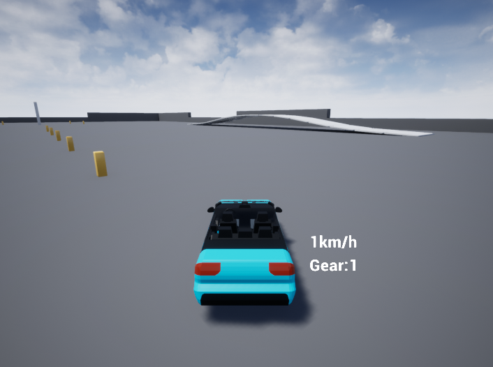
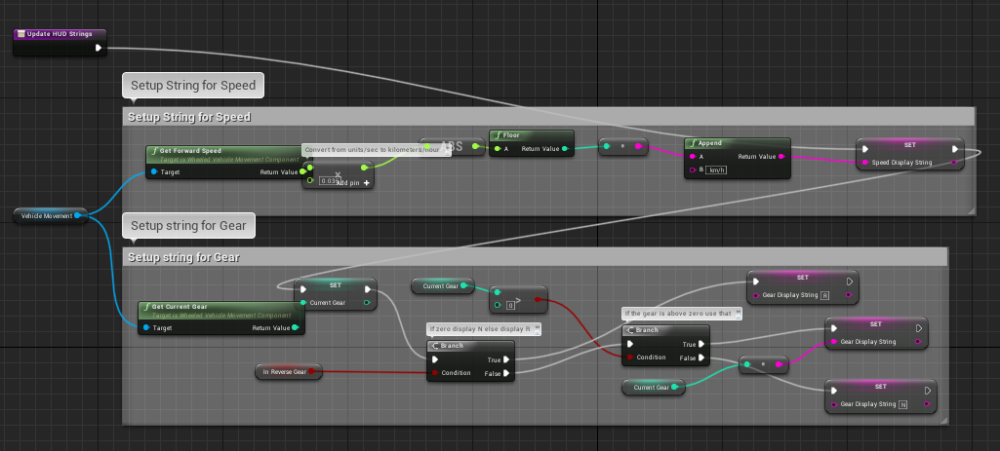
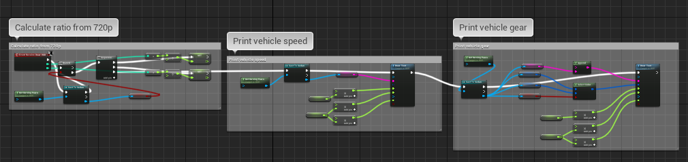

SUE4LuaSample
================

이 예제 프로젝트는 SUE4Lua의 사용 방법을 설명하기 위해 작성된 데모입니다.
UE4의 기본 템플릿 프로젝트인 Vehicle_BP를 Lua로 포팅하였습니다.



프로젝트 열기
------------

생성된 Visual Studio 솔루션 파일을 사용하거나 저희가 제공한 Visual Studio Code 워크스페이스([이것](../../../SilvervineUE4Lua.code-workspace))을 사용해서 프로젝트를 열 수 있습니다.

디버깅이 가능한 Visual Studio Code를 사용해서 작업하시는 것을 강력하게 추천합니다.

소스코드 구성
------------

Lua 코드를 제외한 나머지 코드들은 UE4 게임 모듈을 구현하기 위해 필요한 최소한의 코드들로 작성되었습니다.

Lua 코드는 Source/SUE4LuaSample/Scripts에 있습니다.

* Main.lua

게임이 시작되면 가장 먼저 실행되는 Lua 파일입니다.
[디스패치 핸들러 팩토리](HowToSetupDispatchHandlerFactory_ko.md)와 [디버거를 설정](WorkWithVSCode_ko.md)하고 몇 가지 테스트 코드를 실행합니다.

* Sedan.lua

원본 Sedan Blueprint를 Lua로 포팅한 코드입니다.
원본 Blueprint는 여러 개의 그래프로 구성되어 있는데 그 중에서 가장 복잡한 이벤트 그래프는 아래와 같이 생겼습니다.



이 함수를 Lua로 포팅하면 이렇게 됩니다.

```lua
local function UpdateHUDStrings(self)
    -- Setup String for Speed
    self.SpeedDisplayString = string.format("%dkm/h",
        -- Convert from units/sec to kilometers/hour
        math.floor(math.abs(self.VehicleMovement:GetForwardSpeed() * 0.036))
    )

    -- Setup string for Gear
    if self.InReverseGear then
        self.GearDisplayString = "R"
    else
        local CurrentGear = self.VehicleMovement:GetCurrentGear()
    
        if 0 < CurrentGear then
            self.GearDisplayString = tostring(CurrentGear)
        else
            self.GearDisplayString = "N"
        end
    end
end
```

Sedan.lua의 전체 코드는 [여기](../../../Source/SUE4LuaSample/Scripts/Sedan.lua)에서 확인하세요.

* VehicleHUD.lua

원본 VehicleHUD Blueprint를 Lua로 포팅한 코드입니다.
원본 Blueprint는 아래와 같습니다.



위 그래프를 Lua로 포팅하면 이렇게 됩니다.

```lua
function VehicleHUD:ReceiveDrawHUD(Params)
    --SUE4Lua.Log("VehicleHUD:ReceiveDrawHUD() was called.")

    local SizeX = Params.SizeX
    local SizeY = Params.SizeY

    local OwningPawn = self:GetOwningPawn()
    local Sedan = (UE4.IsValid(OwningPawn) and OwningPawn:IsA('Sedan_C')) and OwningPawn or nil
    
    if Sedan ~= nil and not Sedan.IsInCar then
        -- Calculate ratio from 720p
        local HUDXRatio, HUDYRatio = 0.0, 0.0

        HUDXRatio = SizeX / 1280.0
        HUDYRatio = SizeY / 720.0 

        -- Print vehicle speed
        self:DrawText({
            Text = Sedan.SpeedDisplayString,
            TextColor = UE4.LinearColor.new(1.0, 1.0, 1.0, 1.0),
            ScreenX = HUDXRatio * 805,
            ScreenY = HUDYRatio * 455,
            Font = self.Font,
            Scale = HUDYRatio * 1.4,
        })

        -- Print vehicle gear
        self:DrawText({
            Text = "Gear:" .. Sedan.GearDisplayString,
            TextColor = Sedan.InReverseGear and Sedan.GearDisplayReverseColor or Sedan.GearDisplayColor,
            ScreenX = HUDXRatio * 805,
            ScreenY = HUDYRatio * 500,
            Font = self.Font,
            Scale = HUDYRatio * 1.4,
        })

    end
end
```

VehicleHUD.lua의 전체 코드는 [여기](../../../Source/SUE4LuaSample/Scripts/VehicleHUD.lua)에서 확인하세요.

번들 파일 구성
-------------

이해를 돕기 위해서 [SUE4Lua.zip](../../../Content/SUE4Lua.zip)과 [Game.zip](../../../Content/Game.zip) 파일을 등록시켜 두었습니다.
파일 로더에 대한 설명은 [여기](HowToSetupFileLoader_ko.md)를 참고하세요.

----------------------------------------------------
[프로그래밍 가이드](ProgrammingGuide_ko.md)로 돌아가기