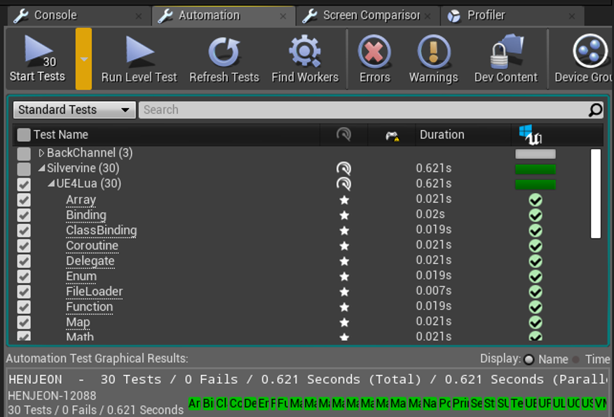
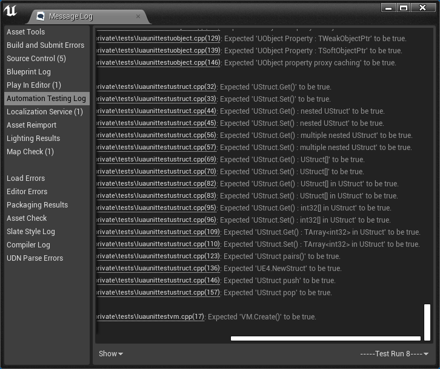

Unit Test
=========

SUE4Lua는 [UE4 자동화 시스템](http://api.unrealengine.com/KOR/Programming/Automation/)을 사용해서 유닛 테스트를 처리합니다.

에디터가 시작되면 등록된 유닛 테스트가 자동으로 실행되며 오류가 발생하면 로그에 해당 내용이 출력됩니다. 

유닛 테스트를 직접 실행하려면 다음과 같이 하세요:
1. Window -> Developer Tools -> Session Frontend로 이동합니다.
2. Automation 탭에서 Silvervine.UE4Lua를 체크하고 시작 버튼을 누릅니다.

 

유닛 테스트 추가하기
------------------

[여기](../Source/SilvervineUE4Lua/Private/Tests)에 유닛 테스트 코드를 추가하세요.

예를 들어 다음과 같이 테스트 코드를 작성하시면 됩니다.
```cpp
//=============================================================================================================================
// FSUE4LuaTestCaseVM
//=============================================================================================================================
IMPLEMENT_SIMPLE_AUTOMATION_TEST(FSUE4LuaTestCaseVM, "Silvervine.UE4Lua.VM", SUE4LUA_ATF_UNITTEST)
bool FSUE4LuaTestCaseVM::RunTest(const FString& Parameters)
{
	auto VM = FSUE4LuaVirtualMachine::Create();

	TestTrue(TEXT("VM.Create()"), VM.IsValid());

	return true;
}
```

----------------------------------------------------
[프로그래밍 가이드](ProgrammingGuide_ko.md)로 돌아가기