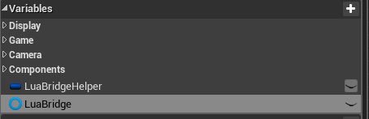
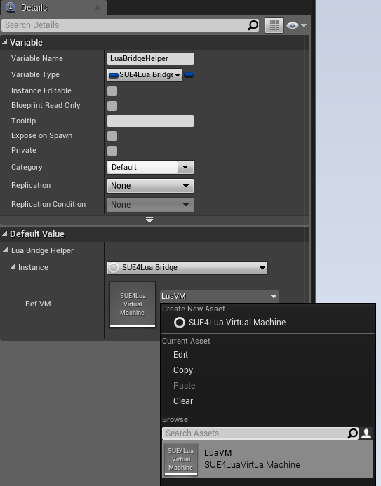
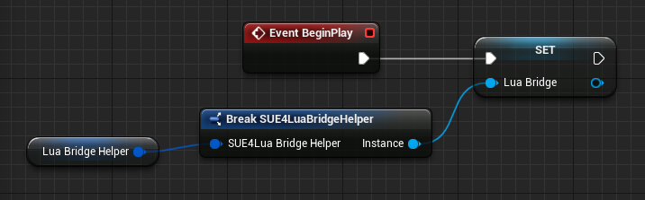
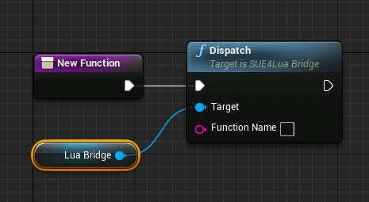
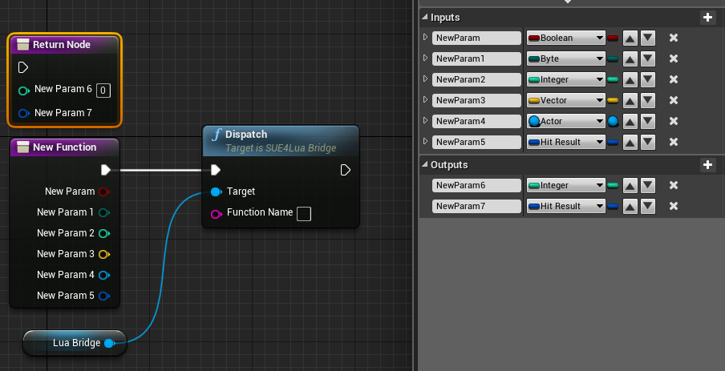
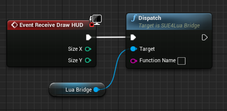
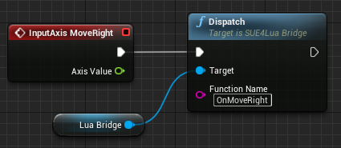

How to Implement a Blueprint Function with Lua
==============================================

When the blueprint function is called, SUE4Lua can find the associated lua function and call it with the arguments passed to the blueprint. We call this feature _Dispatch_.

The dispatch can significantly reduce the complexity of your Blueprints and make it collaborative.

This guide describes how to apply a dispatch to a blueprint.

Getting Started
---------------

SUE4Lua needs some informations to process dispatch. 

1. Name of the lua file containing the implementation of the blueprint
2. Blueprint type information

The first information can be obtained from the lua function named _Dispatch Handler Factory_.
Please see [this](HowToSetupDispatchHandlerFactory.md) for more information. 

The second information can be obtained from the _Lua Bridge_. It is a UObject of 'USUE4LuaBridge' type.
To use the dispatch, you must add the lua bridge variable to the blueprint.

Add the lua bridge variable as follows.



Next, add the _Lua Bridge Helper_ variable of `USUE4LuaBridgeHelper` type. This is a helper object that make it easy to initialize the lua bridge.

After adding variables and compiling the blueprint, set the VM asset as the default for 'RefVM' as shown below. If you haven't created a VM asset yet, plase refer to [this](HowToCreateVMAsset.md).



Now, write the code to initialize the lua bridge. It is recommended to put it in `BeginPlay`.



Finally, open the lua file(we call it _Dispatch Handler_) and write the following code. 

```lua
local MyClass = Class()

return MyClass
```

You are ready for the dispatch!

Note:
* In the code above, 'MyClass' does not have to be the same as the blueprint class name. However, the same name should be used to make the code easier to understand.

How to Dispatch
---------------

Open the desired blueprint function in the editor and write the code as shown below.



Then implement the dispatch handler function in lua. The function name must be the same as the blueprint function name.

```lua
function MyClass:NewFunction(Params)
    SUE4Lua.Log("Hello, World")
end
```

Now when you call `NewFunction()` in the blueprint, "Hello, World" is printed in the output window.
Calling it from lua works well.

Note:
* Functions with different display names from their real names, such as `BeginPlay` or `Tick`, should be used with the real names(`ReceiveBeginPlay`, `ReceiveTick`).
* You can find the real names from the output messages printed by SUE4Lua.

```
LogSUE4L: Error: [LuaVM] [USUE4LuaBridge::DispatchInternal] DispatchHandler is not found: Sedan_C.ReceiveBeginPlay
```

Passing parameters
------------------

Simply declare the parameters in the blueprint function and they will be automatically passed to lua.



The parameters of above function can be used from lua like this:
```lua
function MyClass:NewFunction(Params)
    -- Input
    local NewParam = Params.NewParam
    local NewParam1 = Params.NewParam1
    local NewParam2 = Params.NewParam2
    local NewParam3 = Params.NewParam3
    local NewParam4 = Params.NewParam4
    local NewParam5 = Params.NewParam5

    -- You can call UFunctions with self
    self:SomeNativeFunction(123)
    self:SomeBlueprintFunction(456)

    -- Output
    Params.NewParams6 = ...
    Params.NewParams7 = ...
end
```

Note that the output value should be stored in _Params_, rather than returned by lua function.

**CAUTION**

Do not connect the return node to the graph. If the return node is connected to a graph, the output values passed from lua are ignored.

EventGraph Dispatch
-------------------

Events in the event graph can also be dispatched in the same way.



If you have a function with long name or an event with an editor-generated name, it is convenient to specify a name at the `FunctionName` of the dispatch node.



```lua
function Sedan:OnMoveRight(Params)
    --SUE4Lua.Log("Sedan:OnMoveRight() was called.")

    local AxisValue = Params.AxisValue

    -- Steering inupt
    self.VehicleMovement:SetSteeringInput(AxisValue)
end
```

The real name of above function is `InpAxisEvt_MoveRight_K2Node_InputAxisEvent_15`(The number can be different).

------------------------------------------------
[Back to Programming Guide](ProgrammingGuide.md)