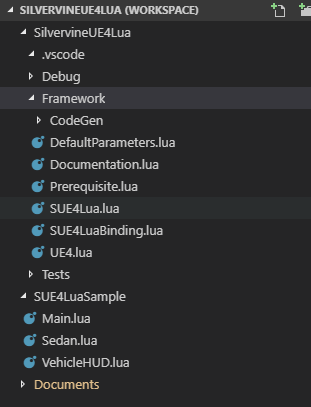
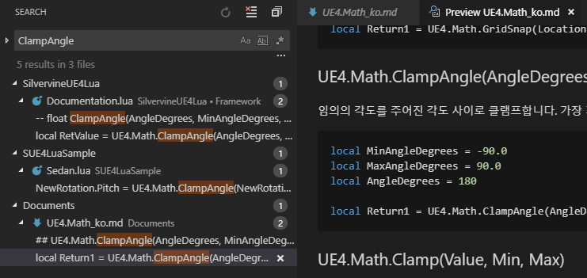
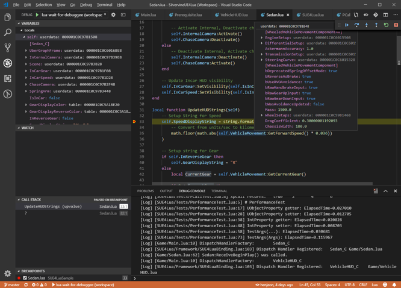

Visual Studio Code로 작업하기
============================

Visual Studio Code(이하 VS Code)를 사용해서 Lua 코드를 편집하고 **디버깅** 할 수 있습니다.
VS Code를 잘 활용하려면 몇 가지 추가 설정이 필요합니다.

참고:
* VS Code는 [여기](https://code.visualstudio.com/)서 다운로드 하세요.

워크스페이스 파일 설정하기
------------------------

다음과 같이 워크스페이스 파일에 Lua 스크립트 폴더들을 등록시켜두면 매우 편리합니다. 



```
"folders": [
		{
			"name": "SilvervineUE4Lua",
			"path": "Plugins/SilvervineUE4Lua/Source/SilvervineUE4Lua/Private/Scripts"
		},
		{
			"name": "SUE4LuaSample",
			"path": "Source/SUE4LuaSample/Scripts",
		},		
		{
			"name": "Documents",
			"path": "Plugins/SilvervineUE4Lua/Documents",
		}
	],
```

Documents 폴더를 워크스페이스에 등록하면 함수를 검색해서 사용법 및 샘플 코드를 바로 찾을 수 있습니다.



Lua Debugger 설치
-----------------

VSCode Extension으로 저희 스튜디오에서 배포한 Lua 디버거가 있습니다.

* Marketplace : https://marketplace.visualstudio.com/items?itemName=devCAT.lua-debug
* 소스코드: https://github.com/devcat-studio/VSCodeLuaDebug/blob/master/Extension/README_ko.md

이 익스텐션을 설치하시면,
* SUE4Lua가 출력하는 디버그 텍스트를 VS Code의 디버그 콘솔로 볼 수 있습니다.
* 브레이크 포인트와 데이터 검사(Inspection) 같은 디버깅 기능을 사용할 수 있습니다.

디버기(Debuggee) 설정하기
--------------------------------

다음과 같은 Lua 코드를 추가해서 Lua VM을 VS Code에 연결합니다. 
Game/Main.lua와 같은 가장 먼저 실행되는 Lua파일에 작성하시는 것이 좋습니다.

```lua
if SUE4Lua.IsDebuggable() then
    SUE4Lua.ExecuteFile("SUE4Lua/Debug/dkjson.lua")

    local debuggee = SUE4Lua.LoadFile("SUE4Lua/Debug/vscode-debuggee.lua")()

    local addUE4Var = function(userdata, addVarFunction)
        if SUE4Lua.IsFixedArray(userdata) or SUE4Lua.IsArray(userdata) or SUE4Lua.IsMap(userdata) or SUE4Lua.IsSet(userdata) then
            for key, value in pairs(userdata) do
                addVarFunction(key, value)
            end
        else
            local curType = userdata:getType()
            while curType do
                addVarFunction('['..curType:GetName()..']', "", true)
                for _, name in pairs(curType:GetPropertyNames()) do
                    addVarFunction(name, userdata[name])
                end
                curType = curType:GetSuperStruct()
            end
        end
    end

    if debuggee.start(json, { addUserdataVar = addUE4Var }) then
        SUE4Lua.OnDebugPrint = function (Text)
            local category = 'log'
            if Text:find("%[Log%]") then
                category = 'log' -- white
            elseif Text:find("%[Warning%]") then
                category = 'warning'-- yellow
            elseif Text:find("%[Error%]") then
                category = 'error'-- red
            end
            debuggee.print(category, Text)
        end
        SUE4Lua.OnTick = function (DeltaTime) debuggee.poll() end
    end
end
```

`F5` 키로 VS Code의 디버깅을 시작한 상태에서 게임을 실행하면 Lua 코드를 디버깅할 수 있습니다.



----------------------------------------------------
[프로그래밍 가이드](ProgrammingGuide_ko.md)로 돌아가기